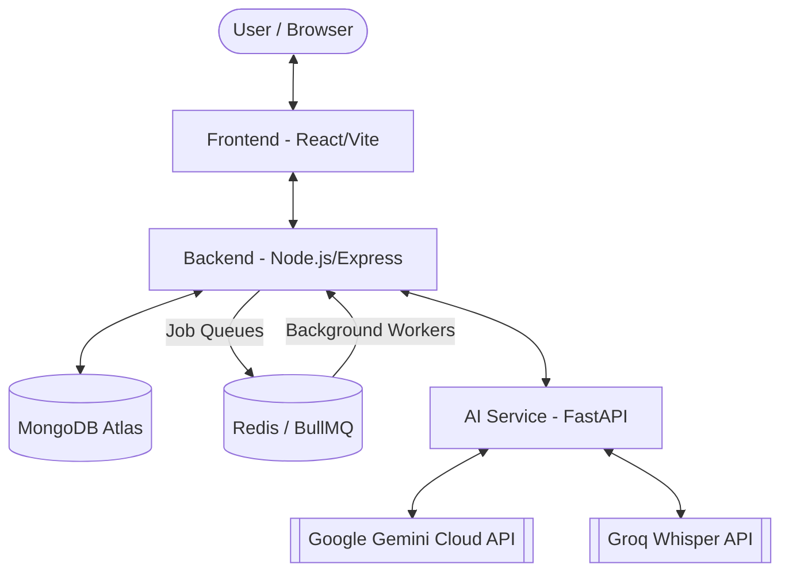

# Prepify - AI-Powered Interviewer 🚀

Prepify is a state-of-the-art AI Interview platform designed to help candidates prepare for their dream roles. By leveraging advanced generative AI and real-time audio processing, Prepify simulates realistic interview scenarios, providing instant feedback and personalized coaching.

---

## 🏗️ Architecture Overview

Prepify follows a modern, distributed 3-tier architecture designed for scalability and performance, integrating background job queues for heavy ML tasks:



- **Frontend**: A "Neo-Dark" React/Vite application utilizing **WebSockets** for real-time progress syncing, and a rich dynamic UI for ATS Resume Analysis and PDF extraction.
- **Backend**: A hardened Express.js server managing authentication (HttpOnly JWT), session orchestration, and **BullMQ Background Workers** via Redis to offload heavy file processing and ML orchestration.
- **AI Service**: A high-efficiency Python microservice that offloads heavy transcription to the **Groq Whisper API**, resume parsing (PyMuPDF), and NLP evaluation tasks to the Google Gemini Cloud API without blocking the Node event loop.

---

## ✨ Key Features

- **🎯 Role & Resume-Specific AI Interviews**: Tailored questions based on job roles, seniority levels, specific tech stacks, and optional user-uploaded resumes (creating personalized real-world project questions) generated dynamically by Gemini.
- **🗣️ Conversational Follow-ups**: Dynamic, context-aware follow-up questions generated by the AI to dive deeper into the candidate's answers, simulating a real, two-way conversational interview flow.
- **🎙️ Live Interview Terminal**: Interactive coder interface with real-time timers, **live code execution via JDoodle**, and **Excalidraw-powered whiteboarding** for system design questions.
- **🧠 Intelligent Evaluation**: Comprehensive feedback on answer quality, communication skills, and technical proficiency via a detailed post-session review.
- **🎮 Gamification System**: Track your progress with XP, level-ups (e.g., "Beginner", "Expert"), daily streaks, and unlockable achievement badges.
- **📈 Advanced Analytics Dashboard**: Deep performance insights over time with visual Chart.js graphs, including Tech vs. Confidence scores, target competency analysis by role, and speech behavioral analytics (Pace WPM, Filler Words, Clarity).
- **💾 Persistent Recording & WebSocket Sync**: Audio recordings are persisted in **IndexedDB**. Heavy AI tasks communicate real-time loading progress directly to the UI via Socket.io.
- **📄 ATS Resume Analyzer & History**: Upload and visualize structured parsed data, with instant ATS scoring, missing keyword detection, and a trackable history of past resume analyses.
- **📝 Automated Cover Letters & PDF Export**: One-click generation of beautifully formatted ATS-optimized Resumes and tailored cover letters dynamically matched to a provided Job Description.
- **🔄 Continuous Integration (CI/CD)**: Fully automated testing (Vitest, Jest, Pytest) and Python linting (Ruff, Mypy) pipelines orchestrated by GitHub Actions.

---

## 🛠️ Tech Stack

| Component | Technologies |
| :--- | :--- |
| **Frontend** | React 19, Vite, TypeScript, Tailwind CSS v4, Redux Toolkit, React Router DOM v7, Framer Motion, Monaco Editor, Excalidraw, Socket.io-client, React-PDF |
| **Backend** | Node.js, Express 5.x, MongoDB, Redis, BullMQ, Socket.io, JWT, Cloudinary, Mammoth, Jest |
| **AI Service** | Python, FastAPI, PyMuPDF, Pytesseract, python-docx, HTTPX (Gemini & Groq APIs), Pydantic, Pytest, Ruff |
| **Deployment / CI** | Render (Services), Vercel (Frontend), MongoDB Atlas, Upstash Redis, GitHub Actions |

---

## 🚀 Quick Start

### 1. Prerequisites
- **Node.js 18+**
- **Python 3.10+**
- **MongoDB** (Local or Atlas)
- **Google Gemini API Key** & **Groq API Key**

### 2. Setup All Components
For detailed setup instructions for each service, please refer to their respective READMEs:
- [/backend](./backend/README.md)
- [/ai-service](./ai-service/README.md)
- [/frontend](./frontend/README.md)

### 3. Running Locally
We've provided a helper script for Windows users:
```bash
./start-all.bat
```
Alternatively, start each service manually as described in the [Deployment Guide](./DEPLOYMENT_GUIDE.md).

---

## 📂 Project Structure

```text
AI-Interviewer/
├── ai-service/     # Python microservice for AI & Audio processing
├── backend/        # Node.js Express server & API
├── frontend/       # React application (Vite/TS)
├── start-all.bat   # Windows start script
└── DEPLOYMENT_GUIDE.md # Detailed deployment instructions
```

---

## 📜 License

This project is licensed under the MIT License - see the [LICENSE](./LICENSE) file for details.


